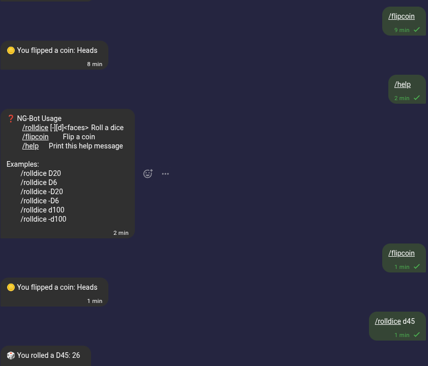

# Proof-of-Concept Delta.Chat bot for .NET

This code is nothing but a proof-of-concept, it's not production ready!  
Currently all the classes are written manually because I can't get the  
JSON-RPC generator to work for any language other than `rust` and `typescript`

# How to use

  - Download the latest [`deltachat-rpc-server`](https://github.com/chatmail/core/releases) release for your platform.
  - Add it to the project directory
  - Create a new Delta.Chat account (on your phone or desktop)
  - Create a backup for that account, this will give you a `.tar` file
  - Copy the `.tar` file to your device
  - Call `client.ImportBackup(<accountid>, <path-to-your-tar-file>)`- 
  - Implement `IMessageProcessor` to process messages

## CommandProcessor Example

 

